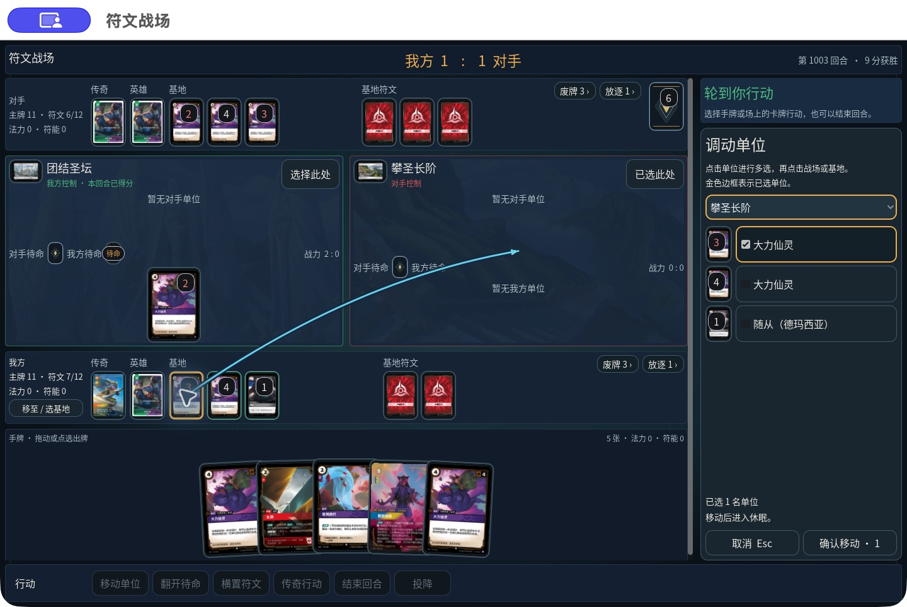
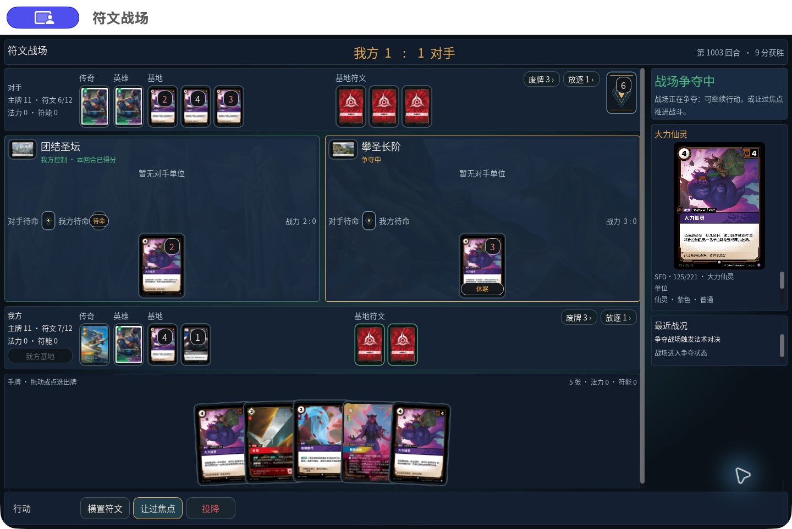

# 原生牌桌与出牌流程迭代记录

执行 [2026-10-05 计划](NEXT_NATIVE_PLAY_ITERATION_2026-10-05.md)。本记录按实测更新，不把未通过的阶段标为完成。

## M1 已实现的牌桌变化

- 深蓝连续桌面；缩小顶栏与空行动区；场上单位 86×120、手牌 108×151（紧凑窗口相应缩小），手牌轻度扇形、悬停与焦点抬起。
- 空卡牌预览/结算链折叠；移动与出牌编辑使用侧栏；主行动固定在底栏右侧。
- 拖拽沿用服务器候选，仅编辑意图。释放到目标或目的地后仍需确认；非法落点不发命令；快照、断线、Esc 使旧手势失效。连线仅表达当前选择。
- 保留点选、多选、右键详情、键盘和权威支付路径。

验证：原生客户端构建 0 警告 / 0 错误；`check-battle-table-interaction.sh` 在 1280×720、1440×900、1920×1080 通过，包含 10 手牌、6 基地公开牌、双方各 3 战场单位及 6 项链的压力样本。检查了合法/非法拖拽、旧手势失效、隐藏身份和重复提交阻断。

macOS 实际鼠标路径：在 `CN-TABLE-FINAL` 开发房，把基地单位拖至“攀圣长阶”，确认前下拉目的地及连线均指向右侧战场；确认后服务端接受移动，快照显示单位进入对应战场并休眠。此局是开发场景，回合数和胜利分数不能代表正式完整对局。截图使用本轮 QA 包，最终交付包仍待后续阶段重新导出。

参考对照：相较 [原画面](evidence/next-native-2026-10-05/01-current-native.jpg)，卡牌比例增大、手牌收为居中扇形、区域边界变轻、无卡时折叠预览；视觉方向来自 [Rift Atlas 公开展示](https://riftatlas.com/play/board-chain-20260908.webp)。尚未以帧时间或无障碍合规衡量该视觉变化。

## 后续阶段

M2 常驻牌确认/触发与反馈正在开发；M3 可恢复再次打出、M4 完整对局和最终双平台验收尚未完成。Windows 环境未收到确认，不可用导出成功替代 Windows 实测。

详细构建与交互日志：`var/qa/iteration-2026-10-05/`。

### M2 引擎阶段验证

普通单位/装备在 `PLAY_CARD` 确认时入场；其打出技能作为 `SourceConfirmed` 连锁项等待响应，法术仍等待双方让过。确认不会伪造 `PRIORITY_PASSED`，技能结算不会再次重置源单位。主行动初始/接受/拒绝/恢复使用同一 prompt 投影，保留禁用候选与原因，只有 `Enabled` 候选可执行。

旧 fixture 的修改只迁移 CN 359.2 / 383.4.a.2 的时机与必要 tick；原有费用、伤害、区域、重放和终局断言继续保留。654 个简单用例中 485 个无打出技能、169 个有技能，另迁移多指令和 Predict 用例；不能把测试数量视为规则覆盖率。

2026-10-05 当前阶段：相邻门禁 `confirmation-after-migration-5.trx` 为 8976 通过、2 失败（禁用候选被旧字符串断言误当作可执行行动）；修正后完整对局、Hub 和战斗生命周期组合 `confirmation-fullgame-network-2.trx` 为 **421/421**。两次结果不能直接相加，组合有重叠。尚待本批最终全量及三条原生流程验收。客户端增加已接受事件高亮与“减少动画”，尚未完成本批最终实机证据。
