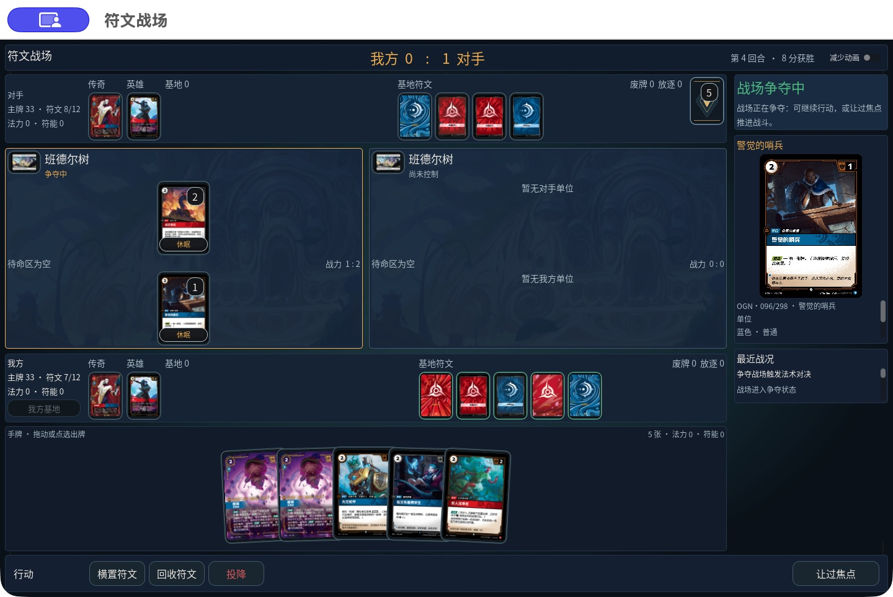

# 原生牌桌与出牌流程迭代记录

执行 [2026-10-05 计划](NEXT_NATIVE_PLAY_ITERATION_2026-10-05.md)，基线 `b0c5dcd6`。本轮已交付牌桌、普通出牌确认、三个效果再次打出流程，以及两场 macOS 原生完整对局。**不将整份计划标为全部完成：Windows 实机验收和下文的复杂规则边界仍未关闭。**

机器可读证据：[acceptance.json](evidence/native-iteration-2026-10-05/acceptance.json)；两局持久化审计：[full-games.json](evidence/native-iteration-2026-10-05/full-games.json)。详细 TRX、构建和客户端日志保存在忽略目录 `var/qa/iteration-2026-10-05/`，不包含在发行包内。

## 1. 实际交付范围

| 阶段 | 已实现及验证 | 尚未关闭 |
|---|---|---|
| M1 牌桌 | 深蓝桌面、大场上牌、扇形手牌、固定底栏、详情折叠、候选连线；双向拖放和点选；实战中手牌固定可见 | 完整键盘/屏幕阅读器/色觉验收未完成 |
| M2 出牌 | 普通常驻牌确认时落场；自身打出技能留链；法术保留双方响应；已接受事件反馈；三条原生流程通过 | 入场后才选目标、多个同时触发完全独立排队、完整 source-generation/LKI，以及待命翻开路径仍需后续工作 |
| M3 再次打出 | 《蚀魂夜》《前来相助》《传送门大营救》共享可持久化选择、权威费用及父效果继续；定向测试和原生重启恢复通过 | 不代表 Plan B 等所有再次打出牌族均已迁移 |
| M4 验收 | 两局互换先手正常 8 分终局；数据库恢复/事件重放一致；macOS 外部目录启动；两平台导出、签名及哈希归档 | Windows 启动、DPI、输入、双平台联机和重连未实测；稳定实战 60 fps 未证实 |

## 2. 官方资料与规则依据

本轮重新执行 `scripts/sync-official.py --date 2026-10-05`。中国区官网上游快照为 **1,414 条**，上一份上游快照为 1,374 条；13 份规则/FAQ/勘误/禁限资料的 PDF 校验值与前一份相同。当前启用的 catalog 仍为 **1,009 条**。下载到的新增卡不自动成为已验证可用卡。

版本和链接见 [rules-manifest.json](../data/official/upstream/2026-10-05/rules-manifest.json)；卡牌差异见 [diff.json](../data/official/upstream/2026-10-05/diff.json)。该差异比较的是当前启用的 1,009 条，不是仅比较昨日上游快照。正式房间仍通过 `ChinaStandard20260724` 牌组校验。

采用中国区核心规则 359.2（常驻牌确认）、359.3（法术进入结算链）、337.1（确认不等同于让过优先权）、383.4.a.2（入场后处理打出触发）、356.1.b（忽略基础费用不免除额外费用），以及 128.6 / 355.10 的隐藏区域选择边界。卡牌依据为 OGN·198/298、SFD·111/221、OGN·102/298 的中国区官方文本。参考网站只用于界面方向。

## 3. 牌桌与原生交互

- 场上单位在主尺寸为 86×120、手牌为 108×151；1280×720 使用紧凑尺寸。基地、传奇及符文保持紧凑，以给双战场和手牌留出空间。
- 手牌独立固定在牌桌底部；11 张真实手牌仍可完整看到。基地和符文溢出在横向牌区内滚动，主行动保持底栏右侧。
- 空预览及空结算链折叠；有卡时展示官方卡图、状态和详情。控制权、争夺、休眠、当前战力及伤害均来自快照。
- 拖放只编辑服务器候选，仍需确认。prompt/tick 变化、断线、Esc 使旧手势失效。最终原生包分别验证左、右战场；非法落点和重复提交由交互门禁覆盖。
- 修复原生 `DragEnd` 先于释放事件导致丢失落点的问题。使用释放事件的窗口坐标，避免系统鼠标位置属于另一窗口时误选默认战场；延迟清理只作用于同一代手势。
- 让过响应、让过焦点和结束回合现在单击提交并防重复；出牌和移动仍保留费用/位置确认。
- 新增独立战斗声明侧栏，区分战场、进攻单位、防守单位和额外效果目标；服务器要求的必需标志自动携带。修复旧模板把战场自身误填为额外效果目标、把必需战斗分配当可选项的问题。

最终争夺画面：

[左侧拖放](evidence/native-iteration-2026-10-05/m4-left-drag.jpg)、[右侧拖放](evidence/native-iteration-2026-10-05/m4-right-drag.jpg)、[战斗声明](evidence/native-iteration-2026-10-05/m4-battle-declaration.jpg)、[11 张手牌](evidence/native-iteration-2026-10-05/m4-long-hand.jpg)。

与 [原画面](evidence/next-native-2026-10-05/01-current-native.jpg) 相比，战场卡牌比例增大，手牌居中扇形，区域边界减轻，空信息栏折叠。视觉方向沿用 [Rift Atlas 公开展示](https://riftatlas.com/play/board-chain-20260908.webp)，保持原生 Godot 实现，未复制其手动改分/任意移动功能。

## 4. 普通出牌与反馈

普通单位/装备确认时即进入其合法位置，不再为常驻牌本身要求两次让过。打出技能通过 `SourceConfirmed` 连锁项等待响应，技能结算不会再次重置源牌；法术仍支付后留链，双方响应完成才结算。确认不伪造 `PRIORITY_PASSED`。

接受、拒绝、恢复使用同一 prompt 投影，保留禁用候选与原因，仅启用候选可执行。事件反馈取自接受后的事件/快照；较新 tick 收敛到最新局面，重连不会重播旧支付/得分反馈。“减少动画”关闭脉冲而保留文字。

三条真实原生流程：

| 路径 | 实际观察 | 证据 |
|---|---|---|
| 普通单位 | 确认后立即休眠落到基地，结算链为空 | [单位即时入场](evidence/native-iteration-2026-10-05/m2-plain-immediate.jpg) |
| 有打出技能单位 | 约德尔导师先入场，自身技能等待双方响应，随后抽一张且不重置源单位 | [响应前](evidence/native-iteration-2026-10-05/m2-trigger-before-response.jpg)、[结算后](evidence/native-iteration-2026-10-05/m2-trigger-resolved.jpg) |
| 法术 | 海克斯射线付 1 法力、1 红色符能；响应前目标未受伤，双方让过后造成 3 伤害 | [响应前](evidence/native-iteration-2026-10-05/m2-spell-awaits-response.jpg)、[结算后](evidence/native-iteration-2026-10-05/m2-spell-resolved.jpg) |

旧 fixture 按官方确认时机迁移：654 个简单用例中 485 个普通落场、169 个带打出技能，另有多指令和 Predict 用例。原费用、伤害、区域和终局断言保留；测试数量不是规则覆盖率。

## 5. 效果再次打出与恢复

新增服务端 `PendingEffectPlayState`：记录执行者、父效果、来源区域、物体世代、减费/忽略费用策略、目的地与是否可放弃。客户端只看到安全摘要和其有权操作的候选，不能自报免费、改换执行者或公开对手手牌。

- **蚀魂夜**：废牌堆单位经过正式打出；忽略基础法力，印刷符能和额外费用仍由共享支付规则计算。
- **前来相助**：在结算中私下选择手牌单位，费用减少 3，打到受控战场；高于 3 费的牌补差额，允许主动放弃。移除旧的“最多 3 费、免费搬到基地”路径。
- **传送门大营救**：先放逐并清理旧对象状态与贴附，由原拥有者在基地再次打出；忽略基础法力和符能，急速等额外费用仍需支付；检查来源世代。

12 个 `OfficialEffectReplayTests` 用例覆盖费用、主动放弃、无合法目的地、原拥有者与控制者不同、额外急速费用、世代变化、父效果继续、子技能、JSON 恢复、幂等及事件重放。

原生房间 `CN-ITERATION-M3-B`：结算《前来相助》后停在再次打出，实际停止并重启服务端，客户端恢复身份和同一选择，再次选择 4 费《大力仙灵》，服务器报价 1 法力；确认后法力 14→13、单位休眠落在受控战场、父法术进入废牌堆。此为定向开发场景，资源数量不计入完整对局验收。

[重启恢复后报价](evidence/native-iteration-2026-10-05/m3-help-recovered-quote.jpg)、[完成再次打出](evidence/native-iteration-2026-10-05/m3-help-complete.jpg)。

## 6. 两场完整原生对局

两端均为本机 macOS 导出的原生客户端，真实鼠标交互；使用通过中国区后端校验的“影焰枪手·烬”预组：40 张主牌、12 张符文、3 张候选战场。第二局使用可重复的房间随机种子覆盖相反先手，没有修改随机状态或提交开发命令。

| 房间 | 先手 | 正常终局 | 恢复和事件重放 |
|---|---|---|---|
| CN-ITERATION-FINAL-A | 完整对局乙 | 第 17 回合，乙 8 : 甲 0 | 验证错误 0，事件重放错误 0，最终哈希一致 |
| CN-ITERATION-FINAL-2 | 完整对局甲 | 第 17 回合，甲 8 : 乙 0 | 验证错误 0，事件重放错误 0，最终哈希一致 |

每局从进房、提交卡组、准备、换牌、横置符文、普通出牌、移动、焦点响应、战斗声明、双方响应、自动伤害/离场、征服和据守，直到正常胜负并返回大厅。第一局结束后从大厅创建第二局。

每局接受 37 条命令，包含 16 次正常结束回合；**DEV 场景、补资源、改分和投降命令均为 0**。第一局保留了修复前两次战斗声明拒绝，修复后继续同一持久化对局；第二局无拒绝命令。完整计数、最终状态哈希及拒绝原因见 [full-games.json](evidence/native-iteration-2026-10-05/full-games.json)。

两局只覆盖上述基本争夺路径，没有自动代表全部卡组、复杂伤害分配或所有触发组合。1v1 单目标伤害由规则自动确定，不把它写成手动多目标伤害分配已验收。

[第一局胜利](evidence/native-iteration-2026-10-05/m4-game-one-win.jpg)、[第二局胜利](evidence/native-iteration-2026-10-05/m4-game-two-win.jpg)。

## 7. 实机中发现并修复的问题

1. 原生可选的 `mode` / `destination` 空字符串可被运行时接受，却被恢复校验拒绝；恢复现在接受 null/确切空值，仍拒绝非法类型和纯空白。
2. 原生移动遗漏可推导的出发区。客户端现在携带服务器提供的 origin；恢复兼容旧的合法推导命令，仍校验来源与目的地。
3. 中文玩家名的开发场景 ready 列表序列化顺序不稳定，现按 ordinal 排序。
4. 观战恢复把受光环影响的有效战力与印刷战力比较，现复用权威有效战力投影；篡改有效战力仍拒绝。
5. 同时清空符文池的玩家列表受字典/JSONB 顺序影响，导致真实整局事件重放失败。新事件稳定排序，仅对该同时事件兼容旧列表排列，不忽略重复或替换玩家，也不放宽其他有序事件。
6. 报价失败返回无 tick 时一直停在“核对中”。同一 request/prompt 的拒绝可结束等待；断线与超时显示失败，不能启用提交。
7. 恢复拒绝后还可能保留可行动界面。连接恢复状态先封锁行动，再等待新权威快照；修复通知与请求完成顺序。
8. 手牌与整个牌桌一起滚动、战斗声明必需项误作可选、左侧拖放丢失目的地，均已通过最终原生流程复查。

## 8. 验证结果与性能边界

| 检查 | 本轮最终结果 |
|---|---|
| 后端全量 | `iteration-final.trx`：**9,372 / 9,372**，0 失败、0 跳过 |
| 客户端构建 | 0 警告、0 错误 |
| 三尺寸牌桌行为 | 1280×720、1440×900、1920×1080 通过；含 10 手牌、每方 6 基地公开牌、每战场每方 3 单位、6 项链的合成压力数据 |
| 原生网络门禁 | `native-network.log` 通过：掉线、身份恢复、请求新快照及失效 token 封锁 |
| 静态交互门禁 | prompt controller、serialization、focused overlays、responsive scene 均通过 |
| 实机 | M2 三条路径、M3 服务重启后的再次打出、M4 两局及左右拖放通过 |
| 导出 | macOS universal、Windows x64，均含托管运行依赖 |
| Windows 实机 | **未执行**，不可用导出成功替代 |

最后一轮帧时间记录：Apple M4、macOS、1440×900，预热 120 帧、采样 900 帧，**合成满场、占位卡面**；平均 8.69 ms、中位 8.64 ms、P95 13.02 ms、P99 18.98 ms、最大 73.39 ms。与先前样本相比存在长尾抖动；并行导出/启动及后台负载没有隔离，不能据此认定抖动根因。**不宣称稳定实战 60 fps**，真实卡图加载、长局及低配设备仍需专门测量。

## 9. 交付包与剩余事项

交付目录：`/Users/dinghaolin/.local/share/riftbound-releases/20261005/`。

- `符文战场.app`：最终原包已在源码目录外实际启动，[截图](evidence/native-iteration-2026-10-05/m4-final-artifact-launch.jpg)。两个对局副本只修改包标识以区分窗口，实际应用代码来自导出包。
- `Riftbound-macos-universal.zip`、`Riftbound-windows-x64.zip`、`SHA256SUMS`；大小和完整哈希见 [acceptance.json](evidence/native-iteration-2026-10-05/acceptance.json)。
- macOS ad-hoc `codesign --verify --deep --strict` 通过；没有 Developer ID 签名或 Apple 公证。Windows 只有构建/导出证据。
- 当前最终应用窗口连接地址预填 `http://127.0.0.1:15103`，本轮本地 API 使用该端口。重新启动时可在大厅修改服务器地址；客户端仍需要后端服务。没有部署公网服务或发布网站。

尚未关闭的必要项：Windows 实际启动及 100%/150%/200% DPI、中文字体、鼠标/键盘、跨平台联机/重连；M2 入场后目标选择、完整同时触发排序、待命翻开与源对象离场再入场的 LKI；真实卡图全局性能及完整无障碍检查。上述内容不靠全量测试数量、下载全部卡牌或导出两平台包自动完成。
