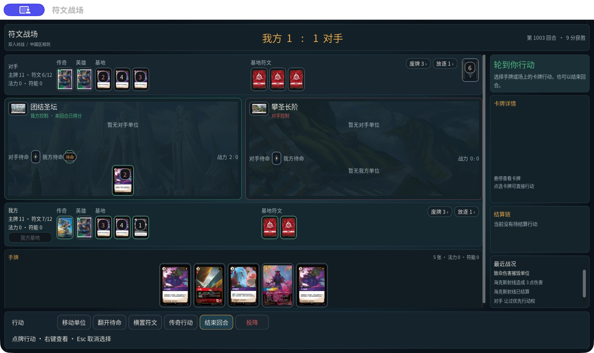
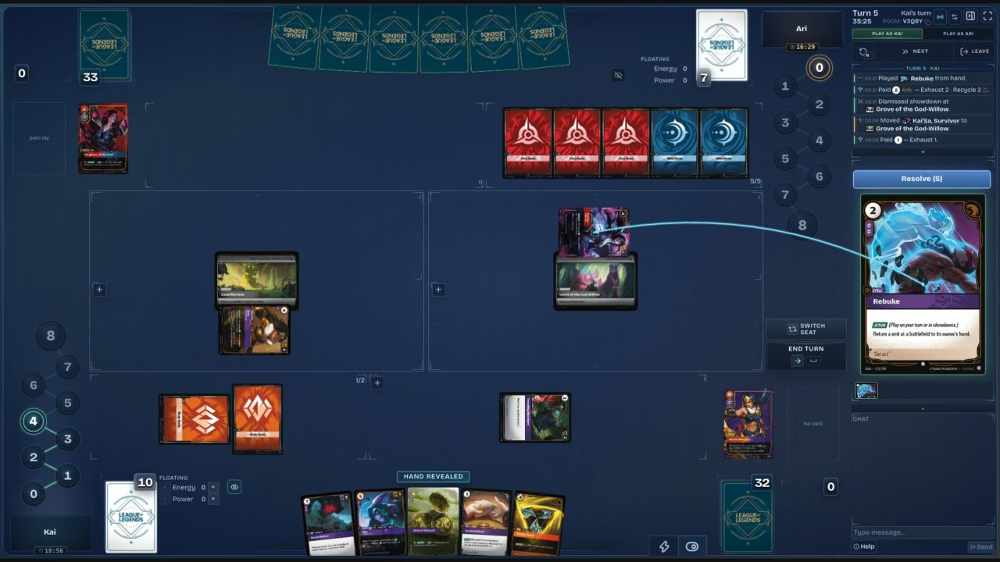

# 下一批迭代：成品牌桌体验与正确出牌流程

规划日期：2026-10-05（Asia/Shanghai）。代码基线：`b0c5dcd6`。**这是规划时的基线记录。** 规划时工作区干净，仅新增规划与截图。随后已实施 M1 牌桌、M2 普通出牌确认、M3 三个代表再次打出流程，并完成 M4 两场 macOS 原生对局；Windows 与复杂触发等未关闭项见 [执行和验收记录](NATIVE_ITERATION_2026-10-05.md)，不能将四项均标为完整验收通过。

目标：桌面继续向成熟对战平台的视觉与操作体验靠近，同时补齐影响连续对局的规则问题。产品保持 Godot .NET 原生 macOS / Windows 客户端，中国区官方规则与禁限牌基线，以及服务端裁定合法性、费用、结算、控制权和计分。

本计划接续 [10 月 4 日牌桌重构](NATIVE_TABLE_REBUILD_2026-10-04.md)；替代 [前一份计划](NEXT_NATIVE_PLAY_ITERATION_2026-10-04.md) 的执行顺序，保留其中尚未完成的规则任务。权威费用预览、桌面点选目标与群组移动已经实现，不重复作为新功能排期。

## 1. 事实、判断与尚未验证的内容

| 类别 | 本轮核对结果 |
|---|---|
| 已确认的实现 | `MatchTableLayout` 已拆出布局；`OfficialCardView` 支持悬停/焦点预览与右键详情；`Main` 将服务器事件和结算链接入桌面。已有侧栏支付及桌面多选移动 |
| 已有验收证据 | 重新读取上一轮 TRX：9344/9344 通过、0 失败、0 跳过；对应 2026-10-04 的测试运行，不能称为本轮新测试。上一轮 macOS 实付、伤害结算和三尺寸门禁见 [验收清单](evidence/native-table-rebuild-acceptance.json) |
| 已确认的规则入口 | `ResolvePlayCard` 普通路径仍设置 `STACK` 位置、`NeutralClosed`、优先权并加入 `StackItems`；《前来相助》注册仍有 `MaxTargetManaCost: 3` 与 `PlaysHandTargetToBase: true`，执行仍走专用搬移分支。前轮规则任务没有随视觉重构自动完成 |
| 设计判断 | 当前区域结构清楚，但卡牌相对牌桌偏小；顶部、底栏和空详情面板占用较多空间；多层同类面板削弱了连续牌桌的观感。需要改善卡牌比例、空间分配、目标关联与动作反馈 |
| 尚未验证 | 未测量完整无障碍合规、帧率或玩家操作效率；没有 Windows 实机结果；未试玩参考平台的完整对局。官网规则是否有晚于已锁定快照的变更，应在规则实施前重新检查 |

## 2. 现场画面与参考范围

本轮沿用 Product Design 的截图审查方法，只检查当前牌桌与参考样式。截图为本轮重新捕获；不把上一轮截图当作本轮现场证据。

| 步骤 | 观察对象与健康度 | 发现及限制 |
|---|---|---|
| 1 | 原生客户端当前对局：结构清楚，空间利用需优化 | 双战场、比分、回合、战况文字可辨；场上卡偏小，空详情面板仍保留较大高度，底栏存在较多常驻文字。此局是开发场景，显示的回合与胜利分数不是正式规则的示例值。仅凭截图不能证明键盘、屏幕阅读器或对比度合规 |
| 2 | Rift Atlas 公开牌桌展示：可用作视觉参考 | 连续深蓝桌面、较轻区域边界、双方镜像布局、扇形手牌、大卡牌预览、目标连线和紧凑的行动区。公开展示图不是本轮实战录像；本轮另确认其模拟器大厅可访问，未创建房间或提交对局 |

当前原生牌桌：

主要视觉参考：

来源：[Rift Atlas 首页](https://riftatlas.com/)、[公开牌桌原图](https://riftatlas.com/play/board-chain-20260908.webp)、[模拟器](https://play.riftatlas.com/)。网页来源上下文截图为 [02-riftatlas-reference.jpg](evidence/next-native-2026-10-05/02-riftatlas-reference.jpg)。这些截图分辨率和局面不同，只支持布局与视觉方向判断，不作为逐像素还原或性能对比。

[Untap.in](https://untap.in/) 的官方说明明确其不强制执行游戏规则，本轮仅将其作为练习、回放等流程研究资料，没有取得其对局截图，不能声称完成其视觉审查。Rift Atlas 也提供手动桌面控制。本平台只借鉴界面与操作表达，不引入任意移动、手工改分或任意撤销正式对局。第三方截图留作参考，不放入客户端资源包。

## 3. 确定的视觉目标

主方向是 Rift Atlas 式连续深蓝桌面，保留中文官方卡图和原生输入方式。没有另起一套网页，也不重新搭建大厅或牌组编辑器。

| 部分 | 下一版具体变化 | 检查方式 |
|---|---|---|
| 整体 | 收起大块品牌区，比分与当前行动集中为紧凑 HUD；减少重复圆角面板，主要边界留给战场、选中对象与当前任务 | 同局面截图核对：卡牌成为视觉主角，区域仍可区分 |
| 卡牌与手牌 | 场上牌放大；手牌采用轻度扇形/重叠、悬停抬起并放大，点选后保持高亮。卡面保持原比例，状态角标避开牌名、费用和战力 | 以 1440×900 为主设计尺寸，初始目标为场上牌约 84–96×118–134、手牌约 100–112×140–157 个逻辑单位；这些是待实机调整的设计目标，不是已测量结果 |
| 对局空间 | 双方基地、传奇、英雄、符文与牌堆形成紧凑的镜像区域；两块战场共享主要中部空间；空区仅保留轻提示 | 常见局面无需滚动整张桌面即可看到双战场、手牌、资源和主行动；溢出在各牌区内部处理 |
| 右侧信息 | 当前任务/响应方固定；有选中或悬停卡时展示大图与卡文；无卡时折叠空预览。结算链存在时提升位置，战况默认只展开近期重点 | 预览、结算链和操作编辑三种状态分别验收，切换不挤掉确认/取消 |
| 行动与选目标 | 主按钮位置稳定，随权威状态显示“确认”“让过响应”或“结束回合”；目标连线关联源牌与目标，合法落点高亮；桌面支持拖拽并保留点选路径 | 拖拽只编辑意图，进入现有确认与权威费用预览，不因拖放直接扣费；非法落点不发送命令 |
| 状态与反馈 | 入场、横置、移动、扣费、伤害、离场和得分使用短暂动效，卡名与数值提示同时出现。控制权、可行动和不可支付采用文字/图形/颜色共同表达 | 动画由已接受事件驱动；关闭动画得到完全相同的最终状态与可操作时机 |

视觉实施先调整现有 `MatchTableLayout`、`MatchTableRenderer`、`OfficialCardView`、`ActionBar` 与主题。尺寸/间距/颜色集中管理；必要时将输入手势与事件呈现从 `Main` 中拆出。避免为本批新增通用插件系统或改换客户端框架。

## 4. 四个可独立交付的迭代

### M1 · 成品牌桌样式与直接操作，优先级 P0

**交付体验：** 较大的场上牌、扇形手牌、悬停放大、紧凑比分/资源、可折叠信息栏、桌面拖拽与目标连线。保留已经实现的点选、多选、右键详情、支付预览和拒绝恢复。

按两个提交推进：先调整视觉比例与区域布局，再加入手势与连线。两者都必须接真实快照和 prompt。拖拽源牌、目的地或目标只能来自服务器候选；本地连线只表达正在编辑的选择。prompt/tick 变化、断线或对象离开区域时立即撤销旧手势与高亮。

完成标准：

- 点选与拖拽生成等价的业务命令；拖到非法对象/区域不提交，拖出窗口和 Esc 能取消未提交的手势；提交期间不能重复确认。
- 普通局面在三种目标尺寸下主行动始终可见；10 张手牌、每方基地 6 张公开牌、每个战场每方 3 个单位、6 项结算链作为布局压力样本，允许区内滚动但不能遮挡响应入口。样本是 UI 压力数据，不宣称它们是任意卡组都能形成的合法局面。
- 卡牌放大不改变点击归属，不遮住必要选择；键盘焦点不因动画丢失，关键目标命中区域至少 44×44 个逻辑单位。
- 保存同局面改造前后截图，并与参考图共同审查卡牌比例、边界层次、手牌、侧栏四项，记录差异；截图只覆盖视觉，功能另由交互门禁与实机操作确认。

### M2 · 正确的普通出牌与结算反馈，优先级 P0

**交付体验：** 玩家清楚知道卡牌是否已入场、当前为何等待、谁需要响应、哪张牌产生了触发；动画顺序与真实结算一致。

先复核中国区出牌确认条款与相关 FAQ，再修正常驻牌和法术的确认路径，沿用已完成的共享费用与只读预览。普通单位/装备自身落场和入场触发分开处理；法术保留合法响应窗口。用权威事件呈现支付、入场、触发、响应、伤害和离场，不能由动画结束或客户端卡牌类型判断推进规则。

完成标准：

- 无额外触发的普通单位/装备，按官方确认时机落场，不额外要求双方为常驻牌本身让过；有触发时准确生成后续选择，法术响应仍正确。
- 针对休眠、急速、装备贴附、额外费用、入场触发顺序、迅捷/反应与战斗窗口先增加失败用例；修改旧等待落场测试时逐项写明官方依据。
- 收到较新的权威快照时可中止过期动效并收敛到最新局面；重连不会重复播放扣费或得分。减少动画模式不改变事件、状态哈希、选择和响应权限。
- 原生完成“普通单位入场”“有入场触发的单位”“法术双方响应后结算”三条真实操作路径；后端针对性、相邻及全量回归分别保留证据。

### M3 · 效果再次打出与可恢复选择，优先级 P1

**依赖：** M2 的确认路径；M1 的桌面和侧栏承载后续选择。

**交付体验：** 效果要求再次打出时，原生客户端显示“由哪张牌产生的选择”，逐步选择牌、位置、费用；结束后回到父效果。先实现《蚀魂夜》《前来相助》《传送门大营救》三个代表效果族，再检查相邻复用入口。

服务器保存执行者、来源区域/物体世代、费用调整、合法目的地、是否允许放弃及父效果继续位置，复用出牌计划和费用计算。客户端不能自报免费或改写执行者；手牌选择不得作为公开目标泄露。

完成标准：

- 《蚀魂夜》检查基础法力覆盖与仍需支付的符能/额外费用；《前来相助》覆盖高于 3 法力的合法单位补差额、受控战场、主动放弃与无合法位置；《传送门大营救》覆盖原拥有者/当前控制者不同、放逐到再次打出、额外费用、旧伤害和贴附清理。
- 目标/来源变化、费用不足、重复请求和过期选择不得错误落场或重复扣费。拒绝保留该选择提交前状态；已经合法完成的父效果步骤按规则保留。
- 玩家关闭面板后能重新进入未完成的必选任务；只有规则允许时显示放弃。断线、服务端持久化恢复和日志重放后，执行者、继续位置、合法候选和最终状态一致。
- 双方快照、prompt、事件、预览及恢复消息均检查隐藏信息；至少一条完整再次打出流程由原生客户端实际操作完成。

### M4 · 连续完整对局与双平台验收，优先级 P1

**依赖：** M1–M3；Windows 执行环境可提前准备，但不可用 macOS 导出代替 Windows 验收。

**交付体验：** 用合法中国区卡组直接练习一场完整对局，从选牌组、进房、换牌、出牌、争夺和响应，直到正常胜负结算及再来一局。练习先利用私有房间和双客户端，不把 AI 对手或赛事系统纳入本批依赖。

完成标准：

- 至少两场互换先后手的完整对局，无开发补资源、预设胜负或投降替代正常终局；未自然覆盖的 M2/M3 边界另做定向场景。
- 等待对手、重连、失败重试、长卡文、长手牌、满场、胜负和再次开局都有可理解反馈；练习卡组必须通过后端中国区牌组校验。
- macOS 最终导出包在源码目录外运行；Windows 实际启动与中文字体、鼠标/键盘、100%/150%/200% 缩放、双端联机和重连分别保存证据。跨平台哈希/事件对照只使用双方有权观察的公共信息。
- 对规则变更跑全量后端回归；对交互变更跑行为门禁及人工实机流程。性能记录测试机器、窗口尺寸、满场样本和帧时间，主流测试机器以稳定 60 fps 为目标，未测量前不写“性能通过”。
- 交付包、SHA-256、签名检查、截图、操作记录、已知问题表分别归档。Windows 未验收时该项保持未完成，不能将整批标为双平台验收通过。

## 5. 执行次序与统一验收约束

执行顺序为 M1 视觉布局 → M1 手势 → M2 确认时机 → M2 事件反馈 → M3 再次打出 → M4 完整对局与双平台。每个迭代独立提交，规则任务先有可失败的官方用例，客户端任务先有真实参考与当前截图。

- 规则基线：实施 M2 前刷新中国区官方规则、FAQ、勘误和禁限牌，记录版本、差异和校验值；线上不可用时明确标记沿用已锁定快照，不声称“官网最新”。已下载的全部卡牌不自动等于全部可用卡牌。
- 窗口：1280×720、1440×900、1920×1080；覆盖长中文卡文、任务侧栏和对手响应。常用文本以可读字号与实测对比度为准，不通过缩小文字解决溢出。色觉与键盘检查独立进行，不以截图宣称完整无障碍合规。
- 交互：正式请求继续携带 prompt/tick 身份；报价只读，提交重新校验。正式对局不加任意撤销、手工改分或跳过结算；目标线和动画不泄露隐藏牌。
- 恢复：一次服务端接受对应一次状态变化；重连、旧回执、乱序消息与重复命令不会重复扣费或保留失效选择。新持久状态同步进入协议投影、序列化、哈希和恢复测试。
- 测试：9344 是已保存回归结果，不是覆盖率或本批目标数量；用规则条款、卡牌族、UI 路径和反例记录覆盖。只修改文档的规划阶段无需重新运行整套测试。
- 外部依赖：Windows 环境、GitHub 推送/工作流权限、发行签名/公证分别记录。上次权限问题不当作本轮重新验证的结果。本批不自动部署公网后端或发布网站。

第一项实施从 M1 的卡牌比例、连续桌面和空侧栏收起开始，保留现有权威出牌链路；这一版视觉与行为通过后再继续其余提交。
