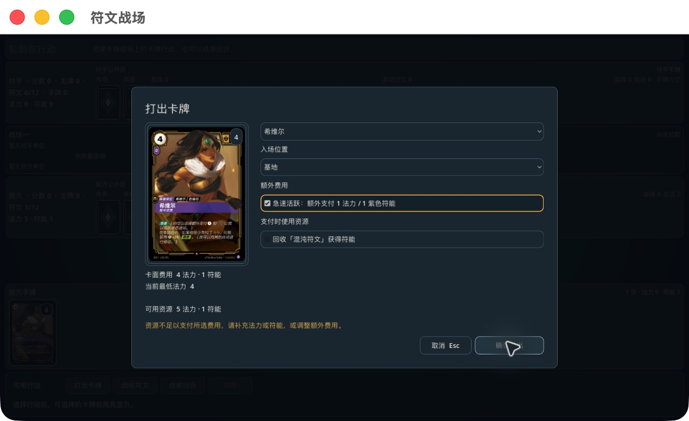
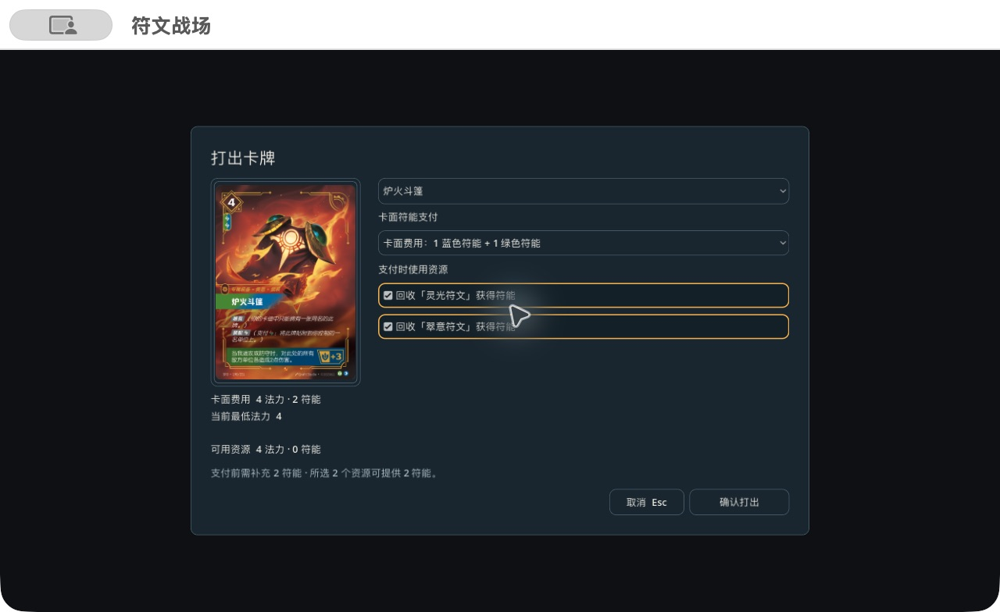

# 2026-10-04 卡面符能费用与原生出牌交互

状态：本批共享费用修正、原生出牌面板和对应验收已完成；最终全量 9328/9328，macOS / Windows 包已导出。此记录不表示完整费用规则、全卡牌效果或 Windows 运行验收完成。

## 权威依据与修正

来源为中国区官方 [规则页面](https://www.playloltcg.com/rules.html)、[卡牌页面](https://www.playloltcg.com/card.html)，以及本地 `data/official/card-catalog.zh-CN.json` 和 `data/official/upstream/2026-10-04/rules-manifest.json`。核心规则 PDF 的 SHA-256 为 `d0e36d00c954b9802c7f6e2889124a3cc4f2001a2fb6178d6c54f4ec98e25f64`。

- CN 131.3 / 135.2.e.6：普通出牌之前没有扣除卡面基础符能，仅计算法力及部分额外符能。现在由共享 `PrintedPowerCostRules` 从官方目录提取总费用，加入支付计划；多特性牌的总符能可分配到对应特性，不能把总额逐特性重复收取。
- CN 135.2.e.5：符文池及合法临时资源中的彩虹符能可以补足指定特性费用。共享 `PaymentCostRules` 同时修正授权、实际扣款与缺口计算，支付窗口、装配和启动技能提示使用相同能力。
- 玩家可通过服务端提供的 `PRINTED_POWER:` 选项选择多特性费用分配。选项进入原始行动记录；服务器校验总额和特性，拒绝伪造、少付及不合法选项。
- 卡面费用与可选额外费用分开记录，避免把基础符能计入依赖可选支付数额的效果。多个符文/临时资源可以共同补足缺口；单个资源不必独自付清全部费用才出现在提示中。
- 验证失败保持状态不变。符文回收、临时资源消耗与最终扣费由后端一起提交。

## 原生交互

`PlayCardOverlay` 按所选手牌/模式呈现卡图、卡面费用、最低法力、目标、入场位置、额外费用和支付资源。多特性分配使用下拉选择，支付资源支持多选。使用已知卡名；展示后端计算的卡面符能缺口。所选资源提供的符能不足后端给出的最低缺口时不能确认；目标组合来自后端合法集合，最终支付与结算仍以服务端为准。

点击合法手牌或“打出卡牌”进入面板；Escape/取消返回桌面。收到不同 prompt/tick 或离开对局时关闭旧面板。卡图异步加载后刷新预览而不重置选择。提交期间禁用重复确认，后端拒绝则保留输入，费用不足显示中文说明；修改选择清除旧错误，成功后关闭。后续仍需更精确的含全部额外费用/税费的即时费用预览，以及服务端支持尚未闭合的复杂效果选择。

## 验证记录

- 卡面费用 red：15 项中的 11 项在接入基础符能前失败，4 项通过；接入后 15/15。彩虹支付底层修正先于这次 red 运行，不能把这份 red 计为彩虹支付的修复前证据。
- 扩展费用 focused：19/19，包含单特性、双特性混合、彩虹补足、额外急速、非法分配、两枚符文原子支付及临时资源。
- 长局费用/回放 focused：23/23（含上述 19 项及 4 个长局），`printed-power-game-verified.trx`。长局驱动通过真正的 `RECYCLE_RUNE` 指令补足后续回合费用；原始命令包含符文对象 ID，回放状态哈希保持一致。
- 原生手工操作生成 `var/qa/printed-power-ui-command.json`，选择一蓝一绿并回收两枚符文；`RIFTBOUND_NATIVE_PAYMENT_COMMAND` 将实际 UI 请求经协议解析器交给引擎，结果与直接命令的状态哈希一致。
- 原生 .NET 构建零警告/零错误；桌面、卡牌、大厅、提示控制器、专用选择面板五个现有门禁通过。
- 本轮 API 15099 与 `NativeNetworkSmoke` 验证快照隐藏信息边界、TCP 断连、认证/房间恢复、新快照和错误重连令牌拒绝，日志 `/tmp/riftbound-payment-network.log`。
- 最终全量 9328/9328，零失败、零跳过，5 分 2 秒（`printed-power-delivery-verified.trx`）。开发场景中蓝/紫符文的牌号也已按官方卡面纠正；GameHub / 急速 / 基础符能相关回归 422/422（`printed-power-native-final.trx`）。
- 最终原生 UI 生成的命令另经 19/19 验证（`printed-power-native-ui-payload-final.trx`）；命令留档为 `docs/evidence/printed-power-native-command.json`。
- macOS 从 `/tmp` 启动最终导出应用，1280×720 下预览、选项、错误反馈和底部按钮完整显示。实连 `haste-payment-colored-recycle`：选择急速但不补额外符能被拒绝，前后快照含 tick 完全一致，输入保留；补选混沌符文成功，支付 5 法力和合计 2 紫色费用，池剩余 0/0、手牌移除、符文回收。当前结算链继续后，希维尔在基地备战。该链的常驻牌时机缺口见下文，不能计为完整打出时序正确性证明。
- Escape 取消保持手牌和资源不变；同身份另一连接回收蓝符文，使 tick 7→8，旧出牌面板自动关闭。双特性原生验收场景中，只勾选一枚符文时确认禁用，勾选蓝/绿两枚并选择 1 蓝 + 1 绿后可提交。
- macOS 系统 codesign 校验通过；Windows ZIP 校验包含 EXE 与相邻 .NET 运行目录。包 SHA-256、验收范围见 `docs/evidence/printed-power-native-acceptance.json`。Windows 没有实机运行证据；macOS 上述均为指定开发局面，不能替代正式卡组从开局到胜负的完整对战。

## 旧测试迁移

`docs/evidence/printed-power-fixture-migration.json` 逐项记录 467 个 JSON 局面的 471 条卡面费用补充。`scripts/audit/migrate-printed-power-fixtures.py` 只处理预计成功的普通出牌命令；保留原有卡牌效果与最终资源预期，更新明确断言的支付总额。不会在运行时自动补钱或绕过费用。

C# 效果测试通过显式预算或 `PrintedCostFixture.Add` 准备指定计划出牌的符能；受影响的中盘脚本在开局 fixture 中准备手牌预算。拒绝测试继续验证原状态不变。旧“彩虹不能支付指定特性”的负例改成正例，错误特性、所有者、资源窗口、重复资源及不足费用的防御用例继续保留。

## 尚未闭合

- 效果再次打出完整流程：《蚀魂夜》《前来相助》《传送门大营救》的来源权限、可选选择、目的地、费用覆盖/减免与恢复仍需统一。
- “忽略费用 / 仅忽略法力 / 忽略所有费用”的不同语义，全部增费/减费顺序，常驻牌立即结算与完整支付中资源技能选择尚未全面验证。
- 多特性基础费用已有分配选择；精确选择从池中先用彩虹还是保留某色、全部额外 [C] 费用的多特性选择仍有后续工作。
- 活跃卡牌目录仍有待并入的新版差异；绿色回归数不等于逐条官方规则或全部卡牌的覆盖率。
- GitHub 工作流推送仍缺 OAuth `workflow` 权限；没有远端 CI 或 Windows 真实运行证据。

## 原生验收截图

实连费用拒绝与输入保留：

双特性支付（后端候选驱动的原生开发验收场景）：

## 下一迭代顺序与验收条件

1. 统一效果再次打出：受信任的来源/目的地权限、忽略基础费用/仅法力/全部费用、可选额外费用与可恢复的后续结算。以《蚀魂夜》《前来相助》《传送门大营救》覆盖废牌堆、手牌、放逐来源，并验证拒绝不变性、隐藏信息、保存恢复和回放。
2. 常驻牌的立即结算与其触发时机：将实体落场、触发收集和法术/技能响应窗口按中国区条款区分；不能以当前所有出牌统一进入响应链作为规则依据。
3. 费用交互完善：后端返回含全部已选额外费用、税费及特性缺口的最终报价，客户端呈现总额和缺口；增加复杂目标、长资源列表和满场下的原生验收。
4. 新卡机制逐族接入和条款台账重审；每批具备协议、共享结算、事件、快照和针对条款的测试后开放。Windows 在具备执行环境后验证启动、缩放、输入、双端对战与断线恢复。
