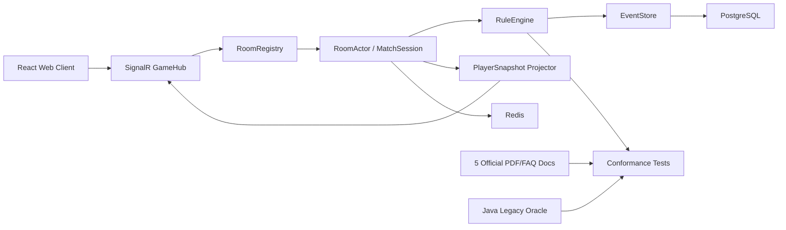

# 《符文战场》新项目总开发计划

更新时间：2026-04-30

## 1. 项目北极星

构建一款精美、稳定、可双人联机对战、服务端权威结算、可长期生产化维护的 Web 卡牌游戏。

新项目的根基是五份官方 PDF、FAQ 与官网卡牌快照。旧 Java 代码只作为历史行为参考、fixture 导出工具和回归对照，不作为架构模板，也不作为最终规则裁判。所有后续开发必须围绕以下产品形态推进：

- 玩家只提交行为意图。
- 服务端自动完成规则裁决和结算。
- 前端只消费合法行动、事件、玩家视角快照和提示。
- 对局可断线重连、可回放、可追责、可测试。
- 每张官方卡牌都有覆盖状态、实现状态和验收证据。

## 2. 技术选型

最终技术方案：

- Backend：C# / .NET 10
- Web Framework：ASP.NET Core
- Realtime：SignalR
- Database：PostgreSQL
- Cache / Presence / Backplane：Redis
- Frontend：React + Vite；开发初期先做精美测试 UI，规则和卡池稳定后再升级为产品级对战 UI
- Testing：xUnit + conformance fixtures + Browser Use 真实前端 smoke，必要时用 Playwright 兜底

核心架构：

## 3. 资料优先级与冲突裁决

1. 五份官方 PDF/FAQ：
   - `《符文战场》核心规则_260330.pdf`
   - `裁判FAQ_251023.pdf`
   - `铸魂淬炼系列_裁判FAQ.pdf`
   - `铸魂淬炼系列_官方FAQ_260114.pdf`
   - `《符文战场》破限系列_裁判FAQ_260416.pdf`
2. 官网卡牌快照：`card-catalog.zh-CN.json`
3. 旧 Java 测试、矩阵和实现

裁决规则：

- 核心规则 PDF 描述不准确、不完善或未覆盖的具体场景，以对应官方 FAQ 澄清为准。
- PDF/FAQ 与卡面冲突：遵循核心规则黄金法则，以卡面为准。
- 官网快照与旧本地卡牌冲突：以官网快照为准。
- 新项目设计与旧 Java 架构冲突：以新项目设计为准。
- 旧 Java 行为与五份 PDF/FAQ 冲突：以五份 PDF/FAQ 为准，Java 差异记录为 legacy oracle mismatch。

## 4. 开发阶段总览

| 阶段 | 名称 | 目标 | 是否可对外试玩 |
|---|---|---|---|
| P0 | 规则和卡牌基线 | 固定规则、卡牌、功能单元、验收口径 | 否 |
| P1 | .NET 联机底座 | GameHub、RoomActor、协议、事件、快照、幂等、重连 | 内部 smoke |
| P2 | 核心规则引擎 | GameState、区域、回合、打出、费用、结算链、战斗、得分 | 基础对局 |
| P2.5 | 开发期测试 UI | 简洁精美的双人测试桌面、手动验收入口、调试面板 | 内部手测 |
| P3 | 卡牌数据与行为系统 | 官方卡牌导入、功能等价、BehaviorSpec、模板执行器 | 规则沙盒 |
| P4 | 高频关键词与基础卡牌 | 805-826 关键词主链路、基础法术/单位/装备 | 可玩 demo |
| P5 | 装备/控制权/触发替换 | 贴附、未激活、owner/controller、替换、触发队列 | 稳定 demo |
| P6 | 全卡牌批量实现 | 按功能逻辑单元批量接入 811 个后端行为 | 扩展牌池 |
| P7 | 产品级 Web 对战 | 精美 UI、动画、回放、观战、战报 | 对外 alpha |
| P7.9 | 本地产品版全卡可玩 | 结构化 ActionPrompt、点击式 UI、传奇/战场规则域、全卡页面操作 | 本地完整 alpha |
| P8 | 生产化 | 账号、匹配、部署、监控、风控、运维 | beta/上线 |

## 5. P0：规则和卡牌基线

目标：

- 建立不可动摇的规则基线。
- 建立 1009 官方条目和 811 功能逻辑单元的开发台账。
- 建立新项目的完成定义。

任务：

1. 抽取五份 PDF/FAQ 章节索引、FAQ 问题索引和关键词术语表。
2. 导入官网卡牌快照。
3. 生成 `OfficialCard`、`FunctionalUnit`、关键词分桶、动作分桶。
4. 标记卡牌类型：单位、英雄单位、法术、传奇、装备、战场、符文、专属牌、指示物。
5. 建立行为状态：`UNSEEN`、`NEEDS_RULE_AUDIT`、`BLOCKED_BY_RULE`、`RULE_READY`、`TEMPLATE_READY`、`IMPLEMENTED`、`CONFORMANCE_PASS`、`UI_SMOKE_PASS`。
6. 建立规则状态：`UNMODELED`、`NEEDS_RULE_AUDIT`、`MODEL_READY`、`ENGINE_READY`、`CARD_VALIDATED`。

产物：

- `docs/rules-card-baseline.md`
- `docs/rules-authority-and-audit.md`
- `docs/development-audit-status.md`
- `docs/master-development-plan.md`
- `docs/rules-evidence-index.md`
- `docs/p2-rules-preflight.md`
- 后续生成 `data/official-card-catalog.json`
- 后续生成 `data/functional-units.json`

验收：

- 卡牌总数、类别数、功能单元数与官网快照一致。
- 每个关键词都能映射到 PDF/FAQ 规则编号或问题编号。
- 每个功能单元都有代表官方编号和所有映射条目。

## 6. P1：.NET 联机底座

目标：

让新服务端具备房间、连接、命令、事件、快照、幂等和重连的生产化骨架。

任务：

1. 完成 solution：
   - `Riftbound.Contracts`
   - `Riftbound.Engine`
   - `Riftbound.Api`
   - `Riftbound.Persistence`
   - `Riftbound.CardCatalog`
   - `Riftbound.ConformanceTests`
2. `GameHub` 支持：
   - `JoinRoom`
   - `Ready`
   - `SubmitIntent`
   - `Pass`
   - `EndTurn`
   - `RequestSnapshot`
   - `Reconnect`
3. `MatchSession` 支持：
   - 每房间单 actor mailbox
   - 串行命令处理
   - `clientIntentId` 幂等
   - command log
   - events
   - P1/P2 snapshot
   - prompt
4. PostgreSQL schema 草案：
   - `matches`
   - `match_players`
   - `command_log`
   - `game_events`
   - `snapshots`
   - `card_catalog_versions`
   - `functional_units`
5. Redis 支持：
   - reconnect token
   - presence
   - idempotency hot cache
   - actor ownership lease
   - SignalR backplane 配置

验收：

- P1/P2 可以加入同一房间。
- 同房间命令严格串行。
- 重复 `clientIntentId` 不推进 tick、不重复写事件。
- 断线重连恢复座位与玩家视角。
- 未实现命令明确返回 `unsupported`。
- 命令、事件、快照可落库。

## 7. P2：核心规则引擎

目标：

实现不依赖具体卡牌特例的通用规则。

当前入口：

- 先执行 `docs/p2-rules-preflight.md`，不要直接扩展全卡牌行为。
- 已完成 schema v2 形状读取、runner 初始状态应用、`MatchState` 基础权威字段、普通回合开始最小规则行为、`END_TURN` 自动推进到下一回合开始的最小闭环、回合结束特殊清理中的伤害移除/本回合内效果失效，清理重复/常规清理最小闭环，先服务《以战养战》的本回合摧毁记忆 `destroyedUnitOwnerIdsThisTurn`，以及先服务多张回收/燃尽洗匀随机顺序的 `seed/rngCursor`。
- P2 核心流程与多类 `PLAY_CARD` preflight 路径已落地：普通回合、优先权、焦点、燃尽、清理、费用/目标/模式、伤害、抽牌、摧毁、回手、移动、战力修正、标签、装备对象和部分替代效果均已有代表路径。当前短状态和 registry 百分比见 `docs/CURRENT_P2_STATUS.md`；完整卡牌/模式覆盖不在本计划重复维护，详见 `docs/p2-rules-preflight.md` 与 `docs/rules-evidence-index.md`。

规则域：

1. 游戏对象模型
   - Card、Unit、Equipment、Spell、Rune、Legend、Battlefield、Token
   - ownerId、controllerId、instanceId、zone、visibility
2. 区域模型
   - main deck、rune deck、hand、trash、banished、base、lane、standby、stack、legend、champion
3. 回合模型
   - turn number、active player、phase、open/closed、normal/spell duel、focus、priority
4. 打出/激活流程
   - choices
   - target validation
   - total cost
   - payment
   - legality
   - stack confirmation
   - resolution
5. 费用系统
   - 法力
   - 指定符能
   - 任意符能
   - 经验
   - 横置/休眠
   - 额外费用
   - 指示文本费用
6. 结算系统
   - stack item
   - pass
   - fizzle
   - spell duel
   - trigger queue
   - replacement pass
   - cleanup pass
7. 战斗系统
   - contested lane
   - attack/defense identity
   - battle spell duel
   - combat damage assignment
   - lethal damage order
   - score
   - winner
8. 行动系统
   - draw
   - ready/exhaust
   - move
   - recall
   - standby
   - discard
   - stun
   - reveal
   - counter
   - buff
   - banish
   - destroy
   - create token
   - attach/detach
   - vision
   - prevent/replace

验收：

- 不接入复杂卡牌时，基础 1v1 对局能从开局走到得分。
- 所有动作都通过 events 改变状态。
- Snapshot 可从 state 投影，隐藏信息不泄漏。
- PDF/FAQ 规则依据齐全，且旧 Java 基础房间/战斗 fixture 可作为回归对照。

## 8. P2.5：开发期测试 UI

目标：

在核心联机底座和基础规则初步成型后，尽早提供一个简单但精美的测试界面，用于开发调试、手动验收和真实双人流程 smoke。它不是最终产品 UI，但必须足够清晰、好用、稳定。

定位：

- 面向开发和手动测试，不面向正式上线。
- 服务端权威，所有按钮来自 `ActionPrompt`。
- 展示真实 `Snapshot`、`Events`、`Prompt`，不模拟规则。
- 能快速复现卡牌、费用、目标、响应窗口和断线重连问题。

功能范围：

1. 房间与连接栏：
   - 创建房间
   - P1/P2 视角切换
   - 自动重连
   - 当前 server/room/player 状态
2. 对战桌面：
   - 双方基地
   - 两条战场
   - 手牌
   - 符文、资源和经验
   - 传奇和英雄
   - 装备贴附和状态标记
3. 操作面板：
   - 当前可执行行动
   - 打出卡牌
   - 支付费用
   - 选择目标
   - Pass / EndTurn
   - 伤害分配
4. 调试面板：
   - 事件日志
   - 当前 prompt JSON
   - 当前 snapshot 摘要
   - command log
   - 一键复制 fixture
5. 测试场景入口：
   - 基础出牌
   - 基础战斗
   - 法术对决
   - 装备装配
   - 控制权边界
   - 指定卡牌起手

视觉要求：

- 不做营销页，不做最终品牌包装。
- 保持桌面清晰、卡牌信息可读、状态明确。
- 使用稳定尺寸的战场、手牌、装备和行动区域，避免测试时布局跳动。
- 支持桌面优先，移动端暂缓。

验收：

- 手动测试者能在 1 分钟内创建房间并分别进入 P1/P2。
- 能通过 UI 跑通基础出牌、移动、Pass、战斗得分。
- 能查看每次服务端事件和玩家视角快照。
- 能在 UI 中完成 conformance fixture 相关场景的手动复验。
- UI 不包含任何前端规则裁决。

## 9. P3：卡牌数据与行为系统

目标：

建立所有卡牌的结构化数据入口和行为执行框架。

任务：

1. 导入官网卡牌：
   - 保留官方 id、编号、名称、副标题、类型、颜色、费用、回收费用、战力、标签、规则文本、图片。
2. 生成功能逻辑单元：
   - 同功能条目映射到同一 `FunctionalUnitId`。
3. 建立规则文本解析：
   - keyword parser
   - cost parser
   - target parser
   - trigger parser
   - effect phrase parser
4. 建立行为规格：
   - `BehaviorSpec`
   - `TriggerSpec`
   - `ReplacementSpec`
   - `ActivatedAbilitySpec`
   - `StaticAbilitySpec`
5. 建立模板执行器：
   - draw
   - damage
   - destroy
   - move/recall
   - stun
   - temp might
   - gain experience
   - assemble
   - echo
   - ambush

验收：

- 所有 1009 条官方卡可被导入并通过 schema 校验。
- 所有 811 功能单元可生成稳定 id。
- 每张牌至少能展示 `UNIMPLEMENTED` 原因，不允许默默缺失。

## 10. P4：高频关键词与基础卡牌

目标：

先完成卡牌覆盖率最大的关键词和动作模板，形成可玩 demo。

优先顺序：

1. 权限关键词：迅捷、反应、急速。
2. 战斗关键词：强攻、坚守、壁垒、后排、游走。
3. 生命周期关键词：瞬息、绝念、预知。
4. 资源关键词：狩猎、等级、鼓舞、法盾。
5. 互动关键词：待命、回响、伏击。
6. 装备关键词：装配、灵便、百炼。

基础卡牌批次：

- 抽牌、伤害、摧毁、眩晕、移动、召回、回收、放逐。
- 临时战力、增益、经验获得/消耗。
- 基础单位、基础法术、基础装备、基础符文、战场被动。

验收：

- 按风险分层确定批次大小，低风险模板不要被 6 个硬限制拖慢。
- 每批必须有：
  - PDF/FAQ 规则点
  - 官网卡面文本
  - engine unit test
  - SignalR/Room test
  - Java legacy oracle conformance fixture 或差异记录
  - 前端 smoke 或等价 E2E

## 11. P5：装备、控制权、触发和替换

状态：P5 representative scope complete as of 2026-05-05；完整批次、验证记录和 deferred 边界见 `docs/CURRENT_P5_STATUS.md`。

目标：

完成最容易造成规则偏差的中高风险底层能力。

优先能力：

1. 装备打出、装配、灵便装配。
2. 贴附、卸除、顶部卡牌、未激活文本。
3. 装备可被单独指定为目标。
4. 装备随宿主移动、宿主离场后卸除和区域归属。
5. owner/controller 分离。
6. 临时控制权、控制权到期、借用单位离场。
7. 守护天使类替换效果。
8. 多替换效果排序。
9. 绝念和离场触发队列。
10. 百炼选择武装、减少装配费用、无法贴附时保持原位。

验收：

- 使用 `75bf7cf` 后 Java 已验证的装备/控制权边界作为首批 oracle。
- 所有装备离场必须断言：
  - 装备真实拥有者
  - 装备当前控制者
  - 宿主引用
  - 公开装备快照
  - 进入哪个区域
  - 谁抽牌或触发

## 12. P6：全卡牌批量实现

目标：

从可玩 demo 扩大到完整官方卡池。

批次策略：

1. 按行为分桶，不按卡包顺序。
2. 先实现高复用模板，再实现独特牌。
3. 异画/复刻只补映射和展示，不重复写规则。
4. 批次大小按风险分层：
   - 低风险：纯数据映射、异画/复刻、已存在模板的同构卡，单批 20-50 个官方条目或 10-20 个功能逻辑单元。
   - 中风险：已有规则域内的新参数、新目标范围、新费用组合，单批 6-12 个功能逻辑单元。
   - 高风险：费用系统、响应窗口、触发/替换、控制权、贴附/卸除、战斗伤害、隐藏信息，单批 1-4 个功能逻辑单元。
   - 史诗级复杂牌：跨多个规则域或引入新队列/新状态，单张独立成批。
5. 高风险能力即使只有 1 个功能逻辑单元，也必须立即跑 conformance 和 E2E。
6. “批次”指验收门禁批次；开发时可以连续实现一组同构模板，但必须按上述风险粒度提交验收证据。

建议批次顺序：

| 顺序 | 范围 | 原因 |
|---|---|---|
| 1 | 符文、基础费用、基础单位 | 所有对局底座 |
| 2 | 抽牌、伤害、摧毁、眩晕 | 高频模板 |
| 3 | 迅捷/反应/法术对决 | 联机交互核心 |
| 4 | 移动/召回/战斗/得分 | 游戏胜负核心 |
| 5 | 待命/伏击/回响 | 响应和额外执行核心 |
| 6 | 装备/装配/灵便/百炼 | 装备体系核心 |
| 7 | 经验/等级/狩猎/鼓舞 | 资源成长体系 |
| 8 | 绝念/瞬息/替换/触发 | 队列和时序核心 |
| 9 | 传奇主动/被动 | 卡组身份核心 |
| 10 | 战场效果 | 场景规则核心 |
| 11 | 指示物和复制 | 生成对象和动态定义 |
| 12 | 独特复杂卡 | 长尾规则 |

验收：

- 1009 官方条目都有状态。
- 811 功能逻辑单元都有实现或明确 blocked reason。
- `CONFORMANCE_PASS` 的能力才可进入正式可玩卡池。

## 13. P7：产品级 Web 对战

目标：

在后端规则、卡池和开发期测试 UI 都稳定后，把测试 UI 的经验沉淀为正式 Web 卡牌游戏体验。

功能：

- 对战桌面、两条战场、基地、手牌、符文、传奇、英雄。
- 服务端行动提示驱动所有按钮。
- 支付面板、目标选择、响应窗口、伤害分配。
- 装备贴附可视化、控制权标识、状态标记。
- 事件日志、战报、动画节奏。
- 断线重连、观战、回放。
- 图鉴和卡牌详情。

原则：

- 前端不裁决规则。
- 前端不持有权威状态。
- 所有交互都来自 `ActionPrompt`。
- UI 只在后端已通过 conformance 的能力上开放。
- 可以复用开发期测试 UI 的可靠交互逻辑，但视觉、动效、信息层级和新手体验按产品标准重做。

## 14. P7.9：本地产品版全卡可玩

状态：P7 已完成；P7.9 正在 P7.9.6，`LEGEND_ACT` 已打通结构化提示、页面操作和九个传奇主动/反应资源小批次（含 Jax 武装贴附/重贴附、Darius 鼓舞资源、Teemo 召回/待命替代、Azir 武装后打出黄沙士兵、Diana/Kai'Sa/Ornn 反应资源，以及 Ezreal 反应抽牌），并已补入十个自动触发小批次（含 Jinx/Draven/Garen/Lux/Annie、Volibear/Fiora 强力单位召符文、Rengar 打出单位 S+1、Leona 眩晕后增益、Sivir 回收符文造金币/敌方单位摧毁重置与 Jhin 高费法术放逐完成）与 Rumble/Lucian/OGS Master Yi/Ahri/UNL Master Yi/Azir 静态传奇小批次；当前实现 `748/811` 功能单元，manual deferred 剩余 `63/811`。当前短交接和批次计划见 `docs/CURRENT_P7_9_STATUS.md`。

目标：

在不进入 P8 生产化的前提下，把 P7 的产品级 Web 对战推进为本地完整 alpha：所有官方卡牌规则能力都有后端实现、conformance 覆盖和页面操作入口；前端通过结构化 `ActionPrompt` 展示合法行动，不手写规则、不持有权威状态。

核心任务：

1. 结构化 `ActionPrompt`：
   - 保留现有 `actions: string[]` 兼容层。
   - 新增合法来源、目标、费用、模式、目的地、prompt/snapshot 版本和 disabled reason。
   - 旧 prompt 下提交必须能被服务端稳定拒绝。
2. 点击式产品操作：
   - 出牌、目标、可选费用、响应、移动、战斗、装备、传奇、战场操作都从 prompt 候选生成。
   - 默认隐藏 raw JSON、fixture draft 和 scenario seed，只保留本地开发折叠入口。
3. 传奇规则域：
   - 实现 `LEGEND_ACT` 命令、传奇主动/被动/静态/触发能力、身份效果和 UI 操作入口。
   - P7.9.6 已迁移 `35/44` 个传奇功能单元；继续关闭剩余 `9` 个传奇 manual deferred 功能单元。
4. 战场规则域：
   - 实现战场控制、据守、征服、得分、战场触发/静态/奖励效果和 UI 操作入口。
   - 关闭 P6 中 `54` 个战场 manual deferred 功能单元。
5. 战斗和长尾整合：
   - 补强多单位战斗、伤害分配、战斗触发、控制权、装备、token/copy 和页面展示边界。
6. 图鉴、日志、战报、回放/观战：
   - 图鉴展示每张卡的可玩状态和实现路径。
   - 事件日志向玩家可读文案升级。
   - 本地回放/观战保持明确边界，直到 P8 持久化和生产身份系统接入。

验收：

- `811/811` 功能单元实现；`0` manual deferred；`0` unimplemented。
- `1009/1009` 官方条目都有实现状态、规则证据和页面可解释状态。
- 所有页面可操作能力均来自服务端 prompt。
- 后端 full test、Conformance、CardCatalogBaseline、GameHubJoin、前端 build、Browser smoke 全绿。
- 工作区最终只剩未跟踪 `riftbound-dotnet.sln`。

## 15. P8：生产化

目标：

让项目具备真实上线条件。

任务：

- 账号和身份认证。
- 房间匹配、好友邀请、私房间。
- 排位/休闲模式。
- 对局恢复、异常处理、认输。
- 观测：日志、metrics、tracing、审计事件。
- 部署：Docker、CI/CD、数据库迁移、Redis、备份。
- 安全：限流、重放保护、输入校验、作弊防护。
- 性能：快照压缩、MessagePack、热点缓存、房间 actor 分布。

验收：

- 灰度环境可稳定运行长时间双人对局。
- 所有非法命令都被拒绝且不污染事件流。
- 对局可从数据库恢复。
- 关键指标可监控和告警。

## 16. 测试体系

测试金字塔：

| 层级 | 内容 | 门槛 |
|---|---|---|
| Rule Unit | 单个规则动作、费用、目标、关键词 | 每个规则域必须覆盖 |
| Card Behavior | 单个功能逻辑单元 | 每个可玩功能单元必须覆盖 |
| MatchSession | 房间串行、幂等、P1/P2 快照 | 每个协议能力必须覆盖 |
| Conformance | PDF/FAQ expected、Java legacy oracle 与 C# 回放对比 | 每个迁移能力必须覆盖 |
| API/SignalR | 真实 Hub 调用 | 每批能力必须覆盖 |
| Browser Use Smoke | 内置浏览器真实前端双人流程 | 每批或高风险能力必须覆盖 |
| Regression Matrix | 1009 条官方卡状态门禁 | 每次卡牌数据更新必须跑 |

Conformance 标准：

- 输入：seed、初始卡组、command log。
- 规则依据：五份 PDF/FAQ 和官网卡面，记录到 fixture 或状态矩阵。
- Java legacy 输出：events、P1 snapshot、P2 snapshot、prompt。
- C# 输出：events、P1 snapshot、P2 snapshot、prompt。
- 对比：忽略时间戳、连接 id、非语义排序；保留 tick、zone、owner/controller、event kind、关键 payload。

Browser Use 阶段性测试：

- P2.5 开发期测试 UI 初版完成后，必须用 Codex 内置浏览器跑通 P1/P2 加入、基础出牌、移动、Pass、战斗得分。
- 每个高风险规则能力完成后必须跑一次真实浏览器 smoke：费用、目标选择、响应窗口、触发/替换、控制权、贴附/卸除、战斗伤害、隐藏信息。
- 中低风险同构批次可按批次末尾集中跑一次，但必须覆盖该批至少一个代表场景。
- 每次 UI 交互结构变化后必须跑一次：按钮、目标面板、支付面板、伤害分配、事件日志和重连入口。
- 每次阶段验收前必须记录浏览器测试证据：本地 URL、roomId、P1/P2 操作路径、实际事件、最终 snapshot 摘要、失败项。
- Browser Use smoke 不替代 conformance tests；它验证真实前端链路、视觉状态和人工可操作性。
- 如果内置浏览器临时不可用，才允许用 Playwright 作为替代，并在验收记录中说明原因，后续恢复后补测。

## 17. 数据库计划

第一阶段 PostgreSQL 表：

| 表 | 说明 |
|---|---|
| `matches` | 对局元数据、状态、seed、规则版本、FAQ 版本、audit 状态、卡牌版本 |
| `match_players` | 玩家座位、连接状态、重连 token hash |
| `command_log` | 客户端意图、命令原文、幂等键、结果、规则依据 |
| `game_events` | 权威事件流，按 match 内 `event_sequence` 单调排序 |
| `state_snapshots` | 服务端权威完整状态快照，记录 `last_event_sequence`，用于恢复和回放校验 |
| `snapshots` | 玩家视角快照，记录规则依据和 `last_event_sequence`，只用于重连视图和一致性校验 |
| `official_cards` | 官网卡牌条目 |
| `functional_units` | 后端功能逻辑单元 |
| `card_behavior_status` | 卡牌实现和验收状态 |
| `oracle_fixtures` | Java legacy oracle fixture 索引，保存 expected、legacy oracle、rules evidence |

强约束：

- `command_log(match_id, player_id, client_intent_id)` 唯一。
- `game_events(match_id, event_sequence)` 唯一递增；保留 `event_tick/event_order` 用于同 tick 内展示和兼容。
- 协议/fixture JSON envelope 带 `schemaVersion`；持久化 payload 后续按领域逐步补 payload 级版本或 upcaster。
- journal 和 fixture 行必须带 `ruleset_version`、`faq_version`、audit 状态和 `rules_evidence`。
- 卡牌快照版本进入 `matches`，保证旧对局可回放。

## 18. 开发纪律

后续开发必须遵守：

- 规则底座先行；开发期测试 UI 在 P2 初步成型后介入；产品级 UI 等规则和卡池稳定后再做。
- 先通用动作，后特殊卡。
- 先 PDF/FAQ evidence 和 fixture，后 C# 实现，最后前端开放。
- 批次大小按风险分层；低风险同构卡可以大批推进，高风险规则小批验收。
- 可交互能力必须定期用 Browser Use 跑真实本地前端，不能只看单元测试和接口结果。
- 未通过 conformance 的卡牌不能进入正式可玩池。
- 任何规则冲突都记录到文档，按资料优先级裁决。
- 不提交规则 PDF/FAQ。
- 不把旧 Java 架构照搬到新项目。

## 19. 下一步执行顺序

新窗口接手时，先读 `docs/CURRENT_P7_9_STATUS.md`、`docs/CURRENT_P7_STATUS.md`、`docs/CURRENT_P6_STATUS.md`、`README.md` 和 `docs/START_HERE.md`。当前只推进 P7.9 本地产品版全卡可玩，不进入 P8 生产账号、匹配、部署、监控或风控。

立即执行：

1. 以 `docs/CURRENT_P7_9_STATUS.md` 为当前状态文件，按批次更新进度、验证和提交。
2. 先做结构化 `ActionPrompt` 兼容层，再让 UI 消费 prompt candidates。
3. 把手填 objectId/JSON 的产品路径替换为点击式来源、目标、费用、目的地和模式选择。
4. 分批补齐传奇和战场规则域，最终关闭当前剩余 `63/811` manual deferred 功能单元。
5. 每个显著 UI 批次跑 Browser smoke；每个规则批次补 conformance、GameHub 或 engine 测试。

已完成的 P1 底座项：

- command log 已保留客户端原始 payload；`SubmitIntent` 的 JSON 原文会进入 journal，并由 PostgreSQL payload 保存为 `rawCommand`。
- recovery 读取/校验路径已建立：可从 PostgreSQL 读取 match、command、events、最新 snapshot/prompt，并校验 event sequence、command 边界和 player view sequence。
- `001_p1_event_store.sql` 已避免在旧库缺少 003 新列时提前创建 sequence 索引。
- P1 提交路径错误码已覆盖未知玩家、空 intent、未开局、unsupported command 和重复 intent 冲突；未 Join 的玩家提交命令不会隐式入座，空 `clientIntentId` 不会由服务端随机补齐。
- RoomRegistry/MatchSession 恢复入口已接入：可恢复 P1 底座状态、lastEventSequence 和已见过 intent；恢复优先使用权威 `state_snapshots`，玩家视角 snapshot 只作为重连视图和一致性校验依据。
- `state_snapshots` 权威状态快照已接入 journal、PostgreSQL schema 和 recovery；恢复时优先使用与当前 `last_event_sequence` 对齐的服务端 `MatchState`。
- `match_players.reconnect_token_hash` 持久化重连已接入；服务端只保存 `sha256:` hash，重连成功会轮换 token/hash，恢复后的 session 可用旧 token hash 重连，不能通过 Join 直接领取新 token。
- `Ready` / 房间生命周期最小状态机已接入：房间从 `EMPTY` 入座到 `SEATING`，双方 Ready 后进入 `IN_PROGRESS`，`FINISHED` 作为后续结算状态保留；Ready/Start lifecycle events 会进入 journal，未开局提交会稳定返回 `MATCH_NOT_STARTED`。
- `WsClientMessage` / `WsServerMessage` 已接入默认 `protocolVersion = 1`、`schemaVersion = 1`，canonical JSON 测试已固定 camelCase envelope 字段；TypeScript DTO、客户端兼容策略和事件 upcaster 仍待后续补齐。
- `docs/p2-rules-preflight.md` 已建立 P2 前置审查：符文池、`END_TURN`、`PASS_PRIORITY`、`PASS_FOCUS`、清理/特殊清理、最小状态模型、事件词表和首批 P2 fixture。

P8 只在 P7.9 完成并通过最终验收后启动。

## 20. 完成定义

一个功能只有同时满足以下条件，才算完成：

- PDF/FAQ 规则点已记录。
- 官网卡面文本已记录。
- 行为规格已结构化。
- C# 实现已完成。
- 单元测试通过。
- MatchSession/SignalR 测试通过。
- Java legacy oracle conformance 通过，或已记录旧 Java 与 PDF/FAQ 的差异。
- 前端 smoke 或等价 E2E 通过。
- 文档和状态矩阵已更新。

## 21. 计划补充项与遗漏清单

当前主计划已覆盖规则、卡牌、联机、测试 UI、测试体系、数据库和生产化主线。以下补充项需要纳入后续阶段任务，避免项目到中后期才暴露工程缺口。

| 优先级 | 补充项 | 建议阶段 | 说明 |
|---|---|---|---|
| P0 | 开发环境与 CI 基线 | P1 前 | 安装/锁定 .NET 10 SDK、Node 版本、Docker Compose、PostgreSQL、Redis；建立 `dotnet build/test`、前端 build、lint、schema 校验的 CI。 |
| P0 | 本地一键启动 | P1 | 提供 `docker-compose.yml`、环境变量模板、数据库迁移命令、前后端启动脚本，保证 Browser Use smoke 可稳定复现。 |
| P0 | 协议版本治理 | P1 | `protocolVersion`、`schemaVersion` 已接入；后续补客户端兼容策略、TypeScript DTO 生成、SignalR 方法版本、事件 upcaster。 |
| P0 | 确定性随机与回放 | P2 | 洗牌、抽牌、随机选择必须由 seed 和事件记录驱动，保证 legacy Java 与 C# 回放可复现。 |
| P0 | 对局恢复策略 | P1-P2 | 明确 actor 崩溃后从 snapshot + events 或 command log 恢复；定义恢复校验、重复事件防护和未完成命令处理。 |
| P0 | 五份 PDF 规则索引与重审 | P1 前 | 抽取核心规则和四份 FAQ 的目录、关键词、问题索引；已开发的 PASS、END_TURN、幂等等能力先标记 `NEEDS_RULE_AUDIT`，重审后再视为完成。 |
| P0 | 卡牌素材与授权策略 | P3/P7 | 官网图片、卡面数据、图鉴展示、缓存、CDN、素材使用范围需要单独确认；开发可用不等于产品可上线。 |
| P1 | 牌组构筑与校验 | P2-P3 | 传奇、选定英雄、主牌堆 40 张、同名上限、专属牌上限、符文牌堆 12 张、战场限制需要独立模块和测试。 |
| P1 | 对局生命周期状态机 | P1-P2 | 房间创建、入座、准备、开局、调度、进行中、暂停、认输、结束、归档，不应只靠 `MatchSession` 隐式状态。 |
| P1 | 计时与掉线策略 | P2.5/P8 | 回合计时、响应窗口计时、掉线宽限、超时自动 Pass/认输、房间清理 TTL，需要先在测试 UI 显示。 |
| P1 | 错误码与用户可读错误 | P1-P2 | 非法命令、费用不足、目标非法、阶段不允许、重连失败要有稳定错误码，前端不能只显示异常字符串。 |
| P1 | Fixture 与场景编辑器 | P2.5 | 开发期 UI 需要指定起手、指定场面、导出 command log、导入 fixture，帮助人工复现复杂卡牌问题。 |
| P1 | 规则覆盖仪表盘 | P3-P6 | 1009 官方条目、811 功能单元、关键词、动作分桶、conformance 状态、Browser Use 状态需要可视化。 |
| P1 | 性能和负载基线 | P5-P8 | 单房间事件吞吐、snapshot 大小、SignalR 消息频率、Redis backplane 延迟、PostgreSQL 写入压力要有基线。 |
| P1 | 断线/并发/乱序测试 | P1-P5 | 并发提交、重复 intent、掉线重连、旧 snapshot 下提交、双端同时操作要进入自动化和 Browser Use smoke。 |
| P2 | 日志脱敏与审计 | P1-P8 | 日志可追踪 matchId/playerId/intentId/eventSeq，但不能泄漏对手手牌、重连 token 或敏感账号信息。 |
| P2 | 管理与调试接口 | P2.5-P8 | 仅开发环境开放房间 dump、事件重放、强制结束、fixture 导入导出；生产环境需要鉴权和审计。 |
| P2 | 国际化和文本策略 | P7 | 当前以中文为主，后续若支持英文或多语言，卡名、规则文本、错误提示和 UI 文案要分层。 |
| P2 | 可访问性与键鼠体验 | P2.5/P7 | 开发期 UI 不做移动端，但应保证桌面键鼠、可读字号、状态对比、按钮 aria 标识，方便 Browser Use 和人工测试。 |
| P2 | 安全边界前置 | P1-P8 | 即使账号后置，也要从早期限制输入大小、命令频率、房间枚举、reconnect token 泄漏和跨房间访问。 |
| P3 | 规则 DSL/模板与手写规则边界 | P3-P6 | 明确哪些效果走数据模板，哪些必须手写 C# RuleHandler，避免出现半数据化、半硬编码的混乱状态。 |

这些补充项不改变主路线：规则底座仍然优先。但现在规则底座必须先纳入五份 PDF 和 FAQ；从 P1 开始就要把工程基线、版本治理、确定性、恢复和测试入口打好，否则后续卡牌迁移越快，返工成本越高。

这份计划是后续开发主线。除非五份 PDF、官网快照或产品目标发生变化，后续开发默认按此顺序推进。
